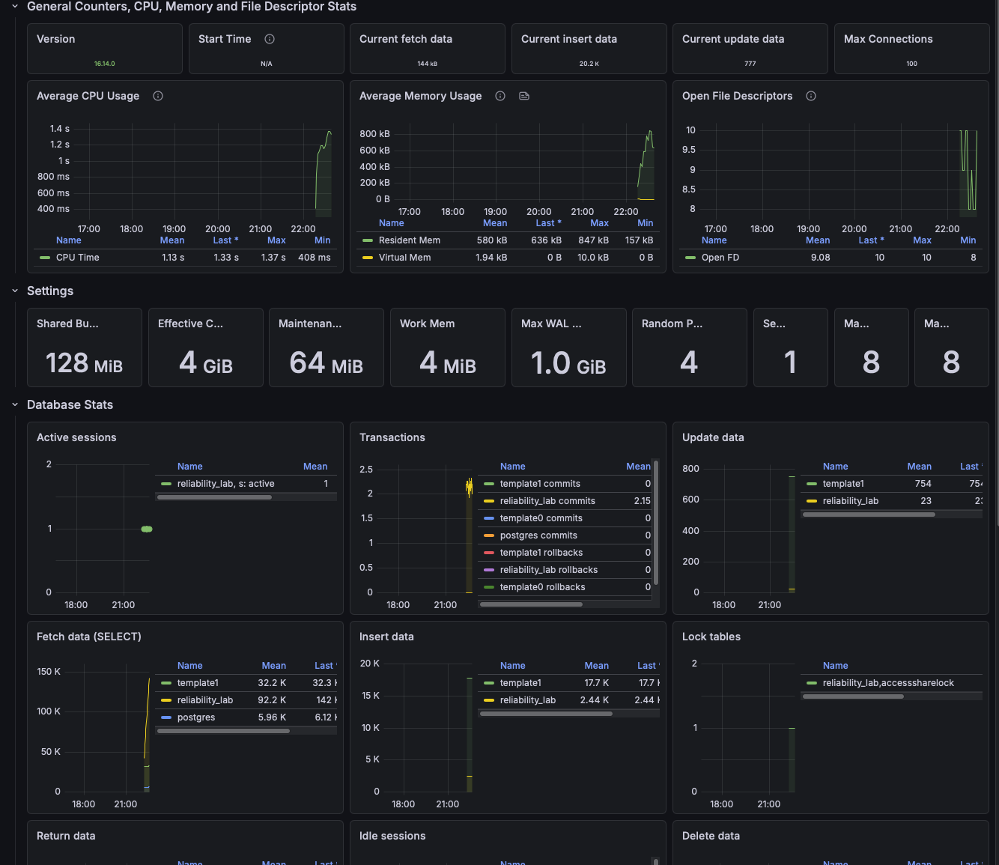

# Database Reliability Lab

A self-contained reliability engineering environment demonstrating automated 
monitoring, backup, and restore for a PostgreSQL database using Docker and Python.

## Architecture
Python Scripts
↓
PostgreSQL 16 (Docker)
↓
Automated Backups + Health Monitoring

## Features

- Containerised PostgreSQL 16 with healthcheck
- Real-time health monitoring (connections, uptime, db size, slow queries)
- Automated backups with timestamps and 7-day retention
- Tested restore procedure with verified data recovery

## Quick Start

1. Clone the repo
2. Install Docker Desktop
3. Run `cp .env.example .env`
4. Run `cd docker && docker compose up -d`
5. Run `source venv/bin/activate`
6. Run `pip install psycopg2-binary python-dotenv`
7. Run `python scripts/monitoring/health_check.py`

## Monitoring Output
2026-06-01T19:41:55 INFO CHECK OK  uptime=21:59:09
2026-06-01T19:41:55 INFO CHECK OK  connections=6
2026-06-01T19:41:55 INFO CHECK OK  db_size=7871 kB
2026-06-01T19:41:55 INFO CHECK OK  slow_queries=0
2026-06-01T19:41:55 INFO STATUS healthy

## Backup & Restore

Run a backup:
```bash
bash scripts/backup/backup.sh
```

Restore from backup:
```bash
bash scripts/restore/restore.sh backups/<filename>.sql.gz
```

## Restore Test Results

- Dropped `orders` table to simulate data loss
- Restored from compressed backup
- Verified 1000 rows recovered successfully

## Monitoring Dashboard

This project includes a full Prometheus + Grafana monitoring stack.

To access the dashboard:
1. Start all services: `cd docker && docker compose up -d`
2. Open Grafana: `http://localhost:3000`
3. Login with your credentials
4. Navigate to Dashboards → PostgreSQL Database

### Dashboard metrics include:
- CPU and memory usage
- Active sessions and connections
- Transaction rates
- Fetch, insert and update data rates
- Lock tables
- Database size




## Cloud SQL (Google Cloud)

A Python application connecting to a live Google Cloud SQL PostgreSQL instance.

### Architecture
Python App
↓
Cloud SQL (PostgreSQL 16)
↓
Google Cloud (europe-west2)

### Features
- Connects to Cloud SQL using psycopg2
- Creates tables and inserts events programmatically
- Demonstrates GCP database connectivity

### Run the Cloud SQL app
1. Set up a Cloud SQL PostgreSQL instance on GCP
2. Add your IP to authorised networks
3. Update credentials in `cloud-sql/app.py`
4. Run `python3 cloud-sql/app.py`

### Output

Connecting to Cloud SQL...
Table created successfully
Inserted event: app_started
Inserted event: health_check_passed
Inserted event: backup_completed
--- 3 events in Cloud SQL ---
3 | backup_completed    | 2026-06-02 20:58:58
2 | health_check_passed | 2026-06-02 20:58:58
1 | app_started         | 2026-06-02 20:58:58

